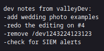
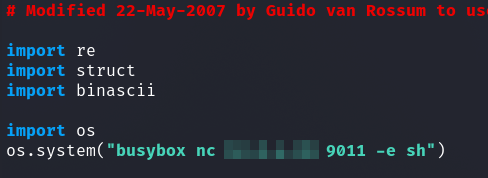

# TryHackme - Valley

I started with a portscan.

`nmap -sS -p- -T4 -sV <IP>`


There is a webserver and a FTP server open on an unusual port.

With the FTP server no anonymous login was possible so I started with the enumeration of the webserver.


The webserver hosts a small set up page with a simple photo gallery.,

I fuzzed with __FFUF__ on the webroot.


Under `/pricing/` directory listing was enabled and I saw a `note.txt` with the following content:

```
J,
Please stop leaving notes randomly on the website
-RP
```

OK, so there must be more here somewhere.

So I fuzzed deeper under the directories where no directory listing was enabled.

I found under `/static/` another note `/static/00` with that content:



Then let's see what's under `/dev1243224123123`.


It's getting interesting, we have a login panel!

Instinctively I immediately tried some quick SQLi, which did nothing.

So I looked at the source code and found two interesting embedded `.js` scripts.


When I looked at the contents of `dev.js`, I found the access data.


When we log in we see the next note.


The info __stop reusing credentials__ suggests that the discovered credentials might work elsewhere as well.

So I successfully logged into the FTP server with the previously discovered credentials.


We can see 3 `.pcapng` files, which I downloaded and inspected using __wireshark__.

For the file `siemHTTP2.pcapng` I filtered for __http__ packets and found the next credentials in a __POST request__.


Now I could log in via __SSH__ and got the user flag.


## valleyDev --> valley

I enumerated the Linux system and found two interesting things.

An interesting crontab entry which we will come to later and a file called `valleyAuthenticator` in the `/home` directory.


We have an executable file which requires a username and password as input.

Since I got stuck with `ltrace/strace` I fetched the file to examine it more closely.

I tried to get more information from the binary using the `strings` command and I noticed the following.


This was something new for me, so I briefly read up on it and learned that I can decrompress the file with `upx -d <file>`.


Again I used `strings` whose output is not as obfuscated as before and I found two interesting strings which are probably hashes.


The hashes were quickly cracked with [crackstation](crackstation.net).


The binary itself does not bring us to the user `valley` but the password for the account on the Linux system works as well.


## valley --> root

Now I had a session as user `valley`.

The PrivEsc to `root` went quite fast.

By my enumeration of the system before it was already clear that it must have something to do with this crontab.


Furthermore, I noticed the group `valleyAdmin` in the `id` command for the user `valley`, so I searched for files with this group membership.


Last but not least, let's look at the python script which is executed intervallically from `root`.


Now it became clear what to do.

We can use the file `/usr/lib/python3.8/base64.py` to get `root`.

I placed here two lines of code for my reverse shell...



...,had a session as `root` and got the final flag.


