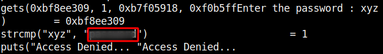

## TryHackMe - Wekor

We start as usual with a regular nmap scan and see which ports are open on the machine.

`nmap -Pn -sV -Pn <IP>`

We can see an SSH service and an Apache web server on the standard port 80.
When we look at the page in the browser we only see a `Welcome Internet User!`.
I looked if there is a `robots.txt` and saw some entries.

Only at the entry `/comingreallysoon` we find something and we see a useful information:

I navigated to the path `/it-next` and saw a page with shopping functions.

I enumerated further, used FFUF, looked which functionalities the page provides and noted all available GET/POST parameters.

Then I tested all parameters for SQL injection using `sqlmap`.
For `it_cart.php` sqlmap quickly spit out a find.

`sqlmap --url http://10.10.76.11/it-next/it_cart.php --method=POST --level 4 --data "coupon_code=12345678&apply_coupon=Apply+Coupon"`

Great, then let's take a look at what can be found in the database.
With the switch `--dbs`. I first looked at the databases which looks like this.

The wordpress database caught my interest and I started dumping and looking at its contents.
The table `wp_user` tells us where this database comes from and also contains the passwords and login names for the wordpress administration area.

I entered the found domain `site.wekor.thm` into the `/etc/hosts` file to navigate to the site and started cracking the found wordpress hashes.
It did not take long and hashcat was able to crack 3 passwords.
So I logged in with the account **wp_yura** which has administrator rights on wordpress, which means we can make modifications here to establish a reverse shell.

I started a netcat listener `nc -nlvp 9876` and went to `Apperance->Theme Editor` to modify the `404.php`.
Here we can place php-code which establishes us a reverse shell and then we have to call it from outside: `http://site.wekor.thm/wordpress/wp-content/themes/twentytwentyone/404.php`

And there it is, our reverse shell.

## Privesc #1
I started to enumerate the system manually and discovered a listening port on 11211 which seemed unusual to me.
I got only an "ERROR" on any interaction, but no banner.
Simple googling for the port number made me smarter and I knew now that we are dealing with **Memcached**.

On https://book.hacktricks.xyz I saw how we can get information from it and I found the user password.

We log in as user Orka and get the first flag.

## Privesc #2

Now to root!

`sudo -l` leads us to an interesting binary.

When we run the binary we are asked for a password, which we don't have.
The password can be easily found out via `ltrace ./bitcoin`.

I had transferred the bitcoin binary to my computer and opened it in ghidra and saw that `python` is called without specifying the full path.

I looked if it is possible to write in a directory of the PATH and saw that we have write permissions in `/usr/sbin`.
So I went to the `/usr/sbin` directory, created a file "python" and placed the code in it which gives us the root shell.

