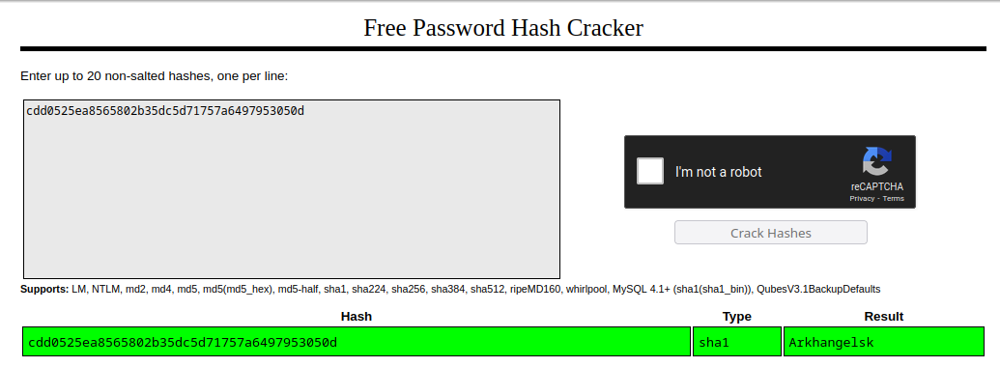

# byuCTF 2023 - 006 2 (Misc)

__Description:__

>You did well recovering the first password, but unfortunately as our hackers were accessing their system the enemies IDS spotted them and they were blocked. We know that Janus reset his password, because we intercepted a different password hash on their network. We can expect that he made this one a bit trickier to guess. Can you crack it in time for us to stop him?

We were now given another hash.

This time, however, it was a __sha1__ hash.

Well, the password was not strong, so it was again enough to get the password via an online lookup on [crackstation](https://crackstation.net/).

Flag: `byuctf{Arkhangelsk}`
