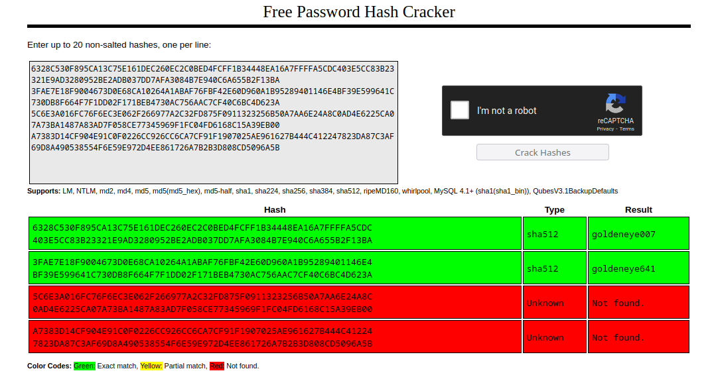

# byuCTF 2023 - 006 3 (Misc)

__Description:__

>We've finally got a foothold in Janus' network, and we're ready to take them down. This time we've recovered a small batch of passwords that seem to belong to various henchmen in his organisation. We'll need all of them cracked so we can do as much damage as possible this time around. Are you up to the task?

>Flag format - byuctf{password1_password2_password3_password4}

This time we were given the following 4 hashes:

```
6328C530F895CA13C75E161DEC260EC2C0BED4FCFF1B34448EA16A7FFFFA5CDC403E5CC83B23321E9AD3280952BE2ADB037DD7AFA3084B7E940C6A655B2F13BA
3FAE7E18F9004673D0E68CA10264A1ABAF76FBF42E60D960A1B95289401146E4BF39E599641C730DB8F664F7F1DD02F171BEB4730AC756AAC7CF40C6BC4D623A
5C6E3A016FC76F6EC3E062F266977A2C32FD875F0911323256B50A7AA6E24A8C0AD4E6225CA07A73BA1487A83AD7F058CE77345969F1FC04FD6168C15A39EB00
A7383D14CF904E91C0F0226CC926CC6CA7CF91F1907025AE961627B444C412247823DA87C3AF69D8A490538554F6E59E972D4EE861726A7B2B3D808CD5096A5B
```

Then let's see what comes out when we pass the 4 hashes [crackstation](https://crackstation.net/).



We see that two passwords could be found.
However, we need all 4 to be able to create the complete flag.

It is interesting that we can see a pattern here!
Both found passwords start with the same word `goldeneye` and end with three numbers.

I took the word `goldeneye` and put it into a file `custom.txt`.

With Hashcat i want to go through all combinations of __goldeneye__ + __3 numbers__.

For this we use a `hybrid attack` through the switch `-a` with the mode number `6`.

Since we want to append three digits in combination with the password we have to add `?d?d?d` to our command.

And for __sha512__ hashes we use `-m 1700`.

The final command `hashcat -m 1700 006_3.txt custom.txt -a 6 ?d?d?d` cracked all 4 passwords and I could submit the flag.

Flag: `byuctf{goldeneye007_goldeneye641_goldeneye069_goldeneye159}`

