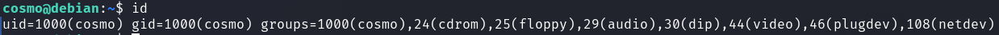
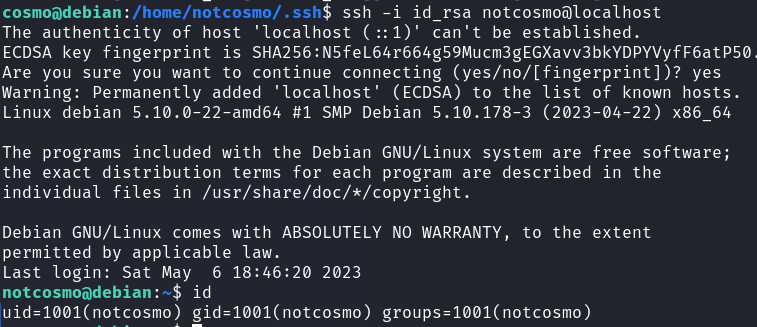
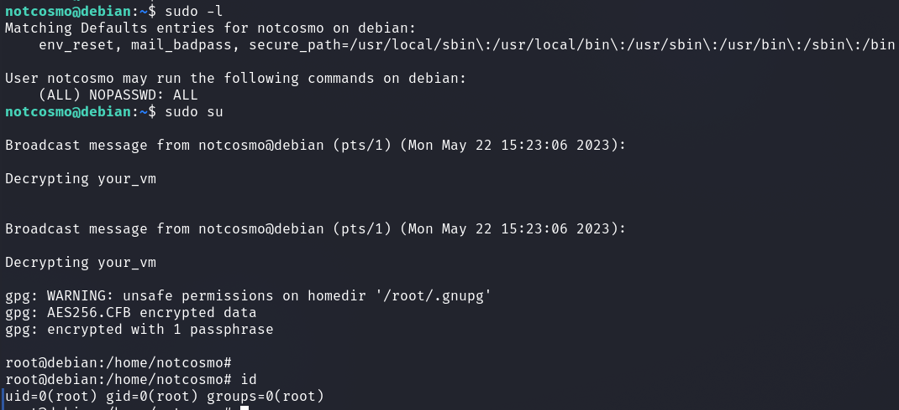
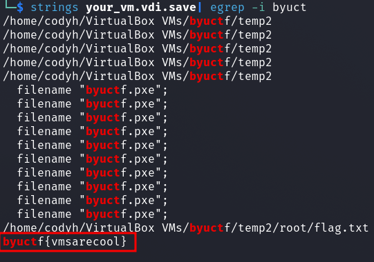

# byuCTF 2023 - VMception (Pentesting)

__Description:__

> A flag is hidden deep inside this vm. 

> Log in with cosmo:password to get started.

## walkthrough

We were given a `.vdi` file which I imported into Virtualbox.

I logged in with the given credentials and was logged in as user `cosmo`.

I looked which other users are on the system.

We can see that there is another user named `notcosmo`.

Probably we have to obtain this user first.

I looked if we can find some interesting stuff in the home directory and lo and behold.

With the existing private keys I could log in to the user `notcosmo`.

After that I looked which `sudo` rights we have and with the liberal set `sudo` rights as we could see it was enough via `sudo su` to change to the user `root`.

In the home directory of `root` was another `.vdi` file named `your_vm.vdi`.

I downloaded this to my host OS and a simple `strings / egrep` command gave me the flag.

Flag: `byuctf{vmsarecool}`

