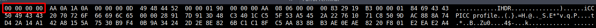
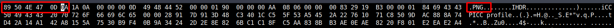
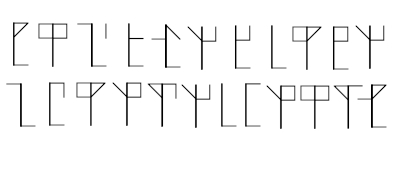

## IncognitoCTF 4.0 - Ancient (Crypto)

In this challenge we were given a broken PNG image.
The solution here was done in two steps.

**Step 1**

The image was not easily viewable.
The `file` command also recognizes the file just as `data`.

```bash
file challenge.png
challenge.png: data
```

Therefore I looked at the file in the HEX editor and saw that the PNG header is missing.



We fix the image by changing the first five bytes to the following values: `89 50 4E 47 0A`.



So, now we have fixed the image and we can look at it.
We see the following:



**Step 2**

I already knew these ciphers through another older challenge.
They are the <ins>*ciphers of the monks*</ins>, an old numbering system!

Each character represents a number, which is a charcode.
I took an ASCII table, deciphered the ciphers and got the flag.

Flag: `ictf{0ld_m0nk_190de1c3}`
