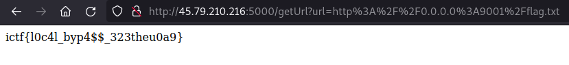

## IncognitoCTF 4.0 - get Flag 1 (Web)

I opened the URL to the challenge and saw the following lightweight page.

All we see is an option to enter a URL.
If we enter a url like `https://google.com` we see that the application is embedding external resources.

**Solution**

On the basis of the given circumstances, the assumption is obvious that we are probably dealing with a [SSRF](https://owasp.org/www-community/attacks/Server_Side_Request_Forgery)
 gap.

In the challenge description it said that the flag is on port 9001.
The hack is done quickly.
We enter `http://0.0.0.0:9001/flag.txt` in the URL form and get the flag.

