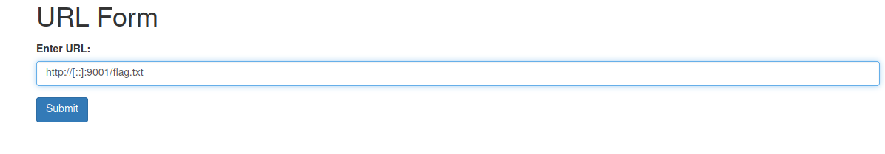
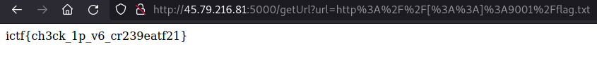

## IncognitoCTF 4.0 - get Flag 2 (Web)

This challenge was a continuation of [get Flag 1](https://github.com/cyber3not/ctf-writeups/blob/main/incognito4.0_2023/getFlag1/getFlag1.md).
The simple solution from before does not work here anymore.

We had to find another bypass and i tried different SSRF filter bypasses.
The solution was to retrieve the flag using **IPv6** notation.

**Bypass**

**Flag**

