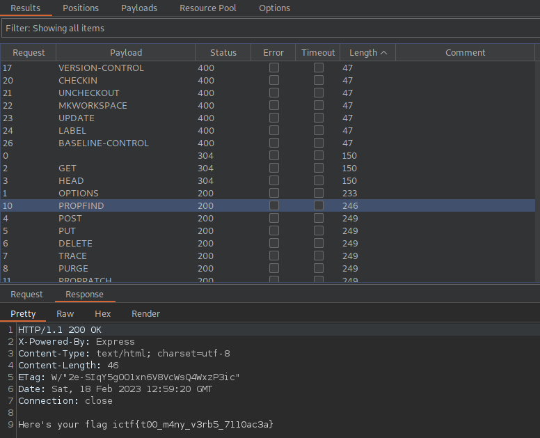

## IncognitoCTF 4.0 - low on options (Web)

I opened the link and saw a lightweight website.
And lightweight is an understatement here.

All there was to see here was this....

Well, that's not very much.
So where is the trick?

I did some enumerations like looking at http-headers,looking for a robots.txt,looking for possible cookie values...

**Solution**

I thought about it a bit and the challenge name gave me the idea that it could have something to do with HTTP methods.

The seclists collection provides a useful fuzzing list with all HTTP methods.
I use Burp to fuzz the HTTP headers.

**Payload Position**

**Flag**

I looked at the responses and sure enough, that was the solution!
On a request with the `PROFIND` HTTP-method we get the flag.

