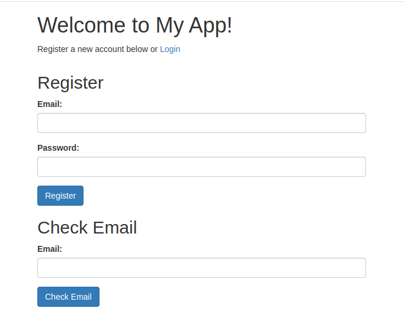
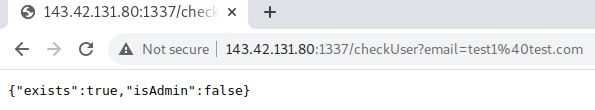
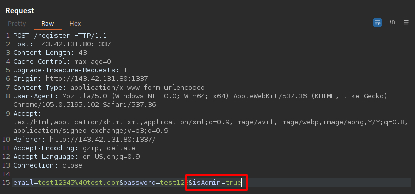
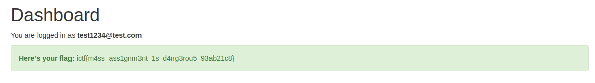

## IncognitoCTF 4.0 - massive (Web)

I opened the link to the challenge and saw the following.

The app provides us with three functions.
We can check an email, log in or register if we don't have an account yet.

The first thing I did was to create a user and take a closer look at the check function of the application.

The check function gives us information by means of two boolean values whether the email exists in the system and whether the associated account has admin rights.

**Solution**

The response of the check function therefore gave me the idea that we can perhaps give ourselves admin rights.
Such vulnerabilities are called [Mass Assignment](https://cheatsheetseries.owasp.org/cheatsheets/Mass_Assignment_Cheat_Sheet.html).

I intercepted the request and added the `isAdmin` with the value `true`.

I logged in with the created user and got the flag.

