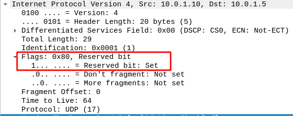

## laCTF - EBE

**Description**

*I was trying to send a flag to my friend over UDP, one character at a time, but it got corrupted! I think someone else was messing around with me and sent extra bytes, though it seems like they actually abided by RFC 3514 for once. Can you get the flag?*

We were given a `.pcap` file with some UDP packets in it.
If we look at the sent data via `Follow->UDP Stream` we get this string:

`Lpy5lUKeaVcg3XTtQVftv{Vx_wk4T7ZMKLaaydWM3AO6R8V_1gvLuT6fqeuvxb_sd8ZnqNGSMSu8T8}JDeO8wXQU1ZeJ7_pZE3gCWx}MhJMf1YWVra}SDW8_PBUhXlgYJKcTN767REmwM6wtO4Z6R7QPiV9qJ7In_1UAC45V0wNv6OW{_hDnyXV}lS4w04_m7HQcqt2ZvfcV3qFAd1iWo_LMWQOvE1NOd_HqnZf2uXF9gfEkY51DVcUDQuNduX4RP{J30}czrL8U0s9PuNgF0}0j5063aA4mLdSFm7e08j4c7gUqZb4}` 

I tried to decode it somehow, but it didn't work, so I found out what `RFC 3514` was all about.

After reading a bit in the corresponding RFC document, I had the idea that the trick must have something to do with the **Security Flag** in the **IP header**.

<ins>Set bit:</ins>

<ins>Unset bit:</ins>

The solution was to filter out the packets with the set bit and read only the data with the unset bit.
The wireshark filter to use is this: `ip.flags == 0x00`.

If we now go through the packets from top to bottom and look at the data field, we see that the correct data is now displayed and we see the flag step by step.

<ins>Flag:</ins>
`lactf{3V1L_817_3xf1l7R4710N_4_7H3_W1N_51D43c8000034d0c}`

